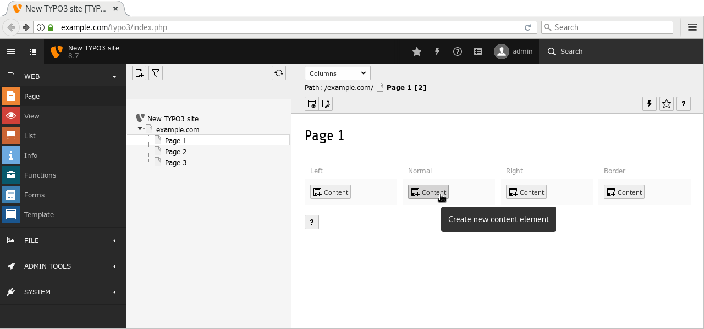
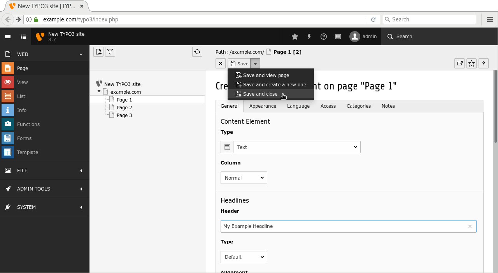
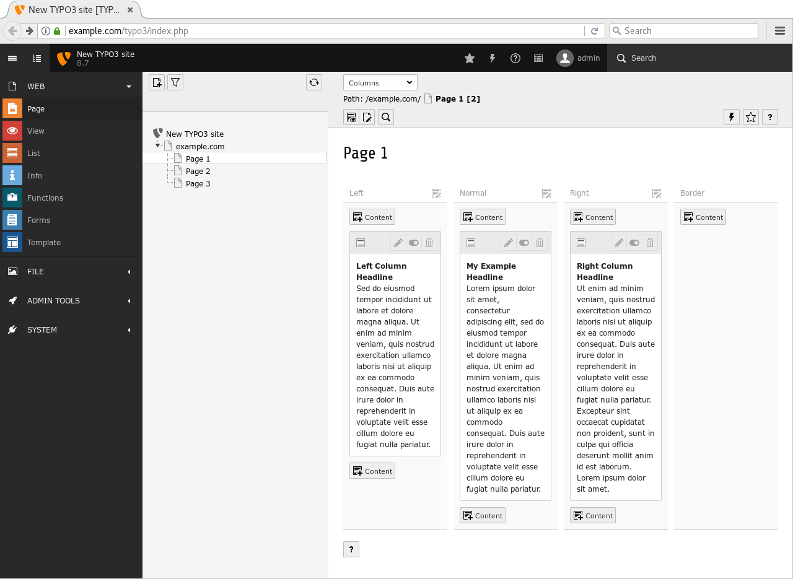

.. include:: ../Includes.txt

.. content-mapping:

Content Mapping
---------------

Having a perfect visual appearance of a website is pointless, if the content editors enter in the backend is not shown at the frontend. In the last step, we map some of the backend columns, which hold content elements such as text, images, etc. to areas in the frontend.
This can be achieved easily by using custom TypoScript.

.. dynamic-content-rendering-in-typoscript:

Dynamic Content Rendering in TypoScript
^^^^^^^^^^^^^^^^^^^^^^^^^^^^^^^^^^^^^^^

Create a new directory ``Configuration/TypoScript/Helper/`` and inside this directory, a new file called ``DynamicContent.typoscript`` with the following content.

::

    lib.dynamicContent = COA
    lib.dynamicContent {
      10 = LOAD_REGISTER
      10 {
        colPos.cObject = TEXT
        colPos.cObject {
          field = colPos
          ifEmpty.cObject = TEXT
          ifEmpty.cObject {
            value.current = 1
            ifEmpty = 0
          }
        }
        pageUid.cObject = TEXT
        pageUid.cObject {
          field = pageUid
          ifEmpty.data = TSFE:id
        }
        contentFromPid.cObject = TEXT
        contentFromPid.cObject {
          data = DB:pages:{register:pageUid}:content_from_pid
          data.insertData = 1
        }
        wrap.cObject = TEXT
        wrap.cObject {
          field = wrap
        }
      }
      20 = CONTENT
      20 {
        table = tt_content
        select {
          includeRecordsWithoutDefaultTranslation = 1
          orderBy = sorting
          where = {#colPos}={register:colPos}
          where.insertData = 1
          pidInList.data = register:pageUid
          pidInList.override.data = register:contentFromPid
        }
        stdWrap {
          dataWrap = {register:wrap}
          required = 1
        }
      }
      30 = RESTORE_REGISTER
    }

Once again, describing what exactly this TypoScript does is not part of this tutorial. The only fact that is important is, that the variable ``lib.dynamicContent`` contains the content in subject to the column and language in the backend. More details about the TypoScript can be found in the :ref:`TypoScript Reference <t3tsref:menu-objects>`_.

.. typo3-backend-create-pages:

Include Dynamic Content Rendering
^^^^^^^^^^^^^^^^^^^^^^^^^^^^^^^^^

To use the TypoScript, it needs to be loaded (*included*), so open file ``Configuration/TypoScript/setup.typoscript`` and add line ``<INCLUDE_TYPOSCRIPT: ... >`` as shown below (second line).

::

    <INCLUDE_TYPOSCRIPT: source="FILE:EXT:fluid_styled_content/Configuration/TypoScript/setup.txt">
    <INCLUDE_TYPOSCRIPT: source="FILE:EXT:site_package/Configuration/TypoScript/Helper/DynamicContent.typoscript">

    page = PAGE
    page {
      ...
    }

    config {
      ...
    }

.. fluid-typoscript-mapping:

Typoscript Mapping in Fluid Template
^^^^^^^^^^^^^^^^^^^^^^^^^^^^^^^^^^^^

Open file ``Resources/Private/Templates/Page/Default.html`` and locate the three columns. They all show a "Headline" (look for the ``<h2>``-tags) and some dummy content (look for the ``
``-tags).

Simply replace these lines with the cObject-ViewHelper (``<f:cObject ... >``), so that file ``Default.html`` shows the following HTML code. Make sure, you specify the column positions correctly (`1`, `0` and `2`) and in exactly this order.

::

    <f:layout name="Default" />
    <f:section name="Main">

      <main role="main">

        <f:render partial="Jumbotron" />

        

          

            

              <f:cObject typoscriptObjectPath="lib.dynamicContent" data="{colPos: '1'}" />
            

            

              <f:cObject typoscriptObjectPath="lib.dynamicContent" data="{colPos: '0'}" />
            

            

              <f:cObject typoscriptObjectPath="lib.dynamicContent" data="{colPos: '2'}" />
            

          

        

      </main>

    </f:section>

.. typo3-backend-add-content:

Add Content in the TYPO3 Backend
^^^^^^^^^^^^^^^^^^^^^^^^^^^^^^^^

Now it's a great time to add some content in the backend. Go to **WEB → Page** and select any of the pages you created before (e.g. "Page 1"). Click the "plus" icon in the column labelled "*normal*" and choose the "Regular Text Element" content element.

Enter a headline (marker 1) some arbitrary text in the Rich Text Editor (RTE) and save your changes by cliking button "Save and close" at the top (marker 2).

The new content element appears in the appropriate column. Repeat this process and enter some further content in columns "*left*" and "*right*", but leave column "*border*" empty.

Preview Page
^^^^^^^^^^^^

Finally, clear the frontend cache and preview the page.

Each of the three columns shows the headline and content.

The last section of this tutorial summarises the achievements, discusses some shortfalls of the extension as it stands now and provides some suggestions what to do next.
