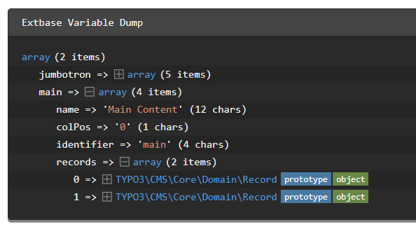

:navigation-title: Content mapping
..  include:: /Includes.rst.txt

..  _content-mapping:

=========================================
Display the content elements on your page
=========================================

In step :ref:`create-section` we moved the part of our template, that will
contain the content, into its own section. This section is however still filled
with dummy content:

..  literalinclude:: _codesnippets/_SectionMain.html
    :caption: Resources/Private/Templates/Pages/Default.html

..  contents::

.. _content-mapping-site-set:

Include the site sets of fluid-styled-content as dependency
===========================================================

In step :ref:`Minimal site package - Create a basic site
set <t3sitepackage:minimal-extension-siteset>` we created a basic site set for
our site package.

Add a dependency to the sets provided by the system extension
:composer:`typo3/cms-fluid-styled-content`. This step is a prerequisite to
display the content in the next steps.

Your site set configuration should now look like this:

..  include:: /CodeSnippets/ExtensionConfiguration/SitePackage-config.rst.txt

..  _cm-dynamic-content-rendering-in-typoscript:
..  _backend-page-layouts:
..  _content-mapping-backend-layout:

Create a default page layout with page TSconfig
===============================================

In order to map the content from the backend to the frontend we create a
new file :file:`Configuration/Sets/SitePackage/page.tsconfig` containing :ref:`page TSconfig <t3tsref:setting-page-tsconfig>`.

..  todo: Link to page TSconfig description in getting started once chapter exist.

By placing the file within the site set, you created in step
:ref:`Create a basic site set <t3sitepackage:minimal-extension-siteset>`, the
newly created file is loaded within the page tree of your site automatically:

..  include:: /CodeSnippets/PageLayout/page.rst.txt

This file automatically includes all `.tsconfig` files from the designated folder
in which we will store the page layouts.

We now create a default page layout with one column and row for the jumbotron:

..  literalinclude:: /CodeSnippets/PageLayout/_Default.tsconfig
    :language: typoscript
    :caption: EXT:my_site_package/Configuration/TsConfig/Page/PageLayout/Default.tsconfig
    :linenos:

..  versionchanged:: TYPO3 13

    Each area in the page layout becomes an identifier that can be used during
    content mapping. If no content element is added in the backend of that page and
    the slide mode is activated, content from the parent page is displayed. This is
    useful for design elements like side bars, jumbotrons or banners that should be
    the same for a page and its subpage. You can find all details of the
    :ref:`Page / backend layouts in the TSconfig reference <t3tsref:backend-layouts>`.

When you make changes to the files of an extension it is usually necessary
to flush all caches by hitting the button.

.. include:: /Images/AutomaticScreenshots/FlushAllCaches.rst.txt

After flushing the all caches the new backend layout is available in the page
properties at :guilabel:` Appearance >  Page Layout > Backend Layout`.

..  include:: /Images/AutomaticScreenshots/ChooseBackendLayout.rst.txt

..  _choose_page_layout:

Choose the page layout in the page properties
---------------------------------------------

Switch to the new backend layout and save the page properties. In the
:guilabel:`Page` module you will see two columns called "Jumbotron" and
"Main Content" now.

If you followed step
:ref:`Load the example data automatically <t3sitepackage:load-example-data>`
the areas "Jumbotron" and "Main" should already contain some example content.

.. include:: /Images/AutomaticScreenshots/CreateNewContentElement.rst.txt

In the database each content element record is stored in the table
:sql:`tt_content`. This table has a column called `colPos`. If the value stored
in column `colPos` is the same as defined in the page layout in page TSconfig
the content element is displayed in the according area of the page layout.

It is considered best practice to store the main content in an area with
`colPos=0`. This makes switching between different layouts easier.

..  _cm-typo3-backend-create-pages:
..  _page-content-data-processor:

Content rendering via page-content data processor
=================================================

..  versionadded:: TYPO3 13
    The TypoScript object `PAGEVIEW` and the data processor `page-content`
    have been added.

    If you are using TYPO3 v12.4 read :ref:`content element mapping in TYPO3
    v12.4 <t3sitepackage/12:cm-typo3-backend-create-pages>`

The TypoScript object :ref:`PAGEVIEW <t3tsref:cobj-pageview>`, that we
defined in step :ref:`Fluid version of the minimal
site package <t3sitepackage:minimal-extension-fluid>` enables us to introduce
a data processor to facilitate content mapping.

Edit the TypoScript configuration of the `PAGEVIEW` object to define a
data processor of type :ref:`page-content <t3tsref:PageContentFetchingProcessor>`:

..  literalinclude:: _codesnippets/_pageview.diff
    :caption: Configuration/Sets/SitePackage/setup.typoscript (diff)

This data processor provides the variable `content` to your Fluid template.

You can debug this variable in the main section of your template using the
:ref:`Debug ViewHelper <f:debug> <t3viewhelper:typo3-fluid-debug>`:

..  literalinclude:: _codesnippets/_SectionMainDebug.diff
    :caption: Resources/Private/Templates/Pages/Default.html

The debug output after clearing all caches and previewing the page should look
like this:

    The debug output should contain sections "jumbotron" and "main"

..  tip::
    Does your debug output show "NULL" instead? Check the following:

    *   Is `{content}` spelled correctly and uses the correct syntax?
    *   Did you :ref:`define and include the page layout <backend-page-layouts>`?
    *   Did you :ref:`choose the correct page layout in the page properties <choose_page_layout>`?
    *   Did you define the correct data processor `page-content` in TypoScript?
    *   Did you override the default variable name using
        :confval:`as <t3tsref:pagecontentfetchingprocessor-as>` in the data processor?

..  _cm-fluid-typoscript-mapping:

TypoScript mapping in Fluid template
====================================

Open the file :file:`Resources/Private/Templates/Page/Default.html` and locate the
main content area. It contains a headline (look for the :code:`<h2>`-tags) and
some dummy content (look for the :code:`
`-tags).

Replace these lines with a :ref:`Fluid for-loop <t3viewhelper:typo3fluid-fluid-for>`,
rendering each content element using the
:ref:`CObject ViewHelper <f:cObject> <t3viewhelper:typo3-fluid-cobject>`:

..  literalinclude:: _codesnippets/_SectionMainRender.diff
    :caption: Resources/Private/Templates/Pages/Default.html (diff)

For content elements the main type is always `tt_content`. Therefore we include
the TypoScript object :typoscript:`tt_content` here. It is defined in the TypoScript
of the system extension :composer:`typo3/cms-fluid-styled-content`. We included
the site set of that extension in step :ref:`content-mapping-site-set`.

`fluid-styled-content` internally uses
Fluid templates and TypoScript with data processors just like the ones we were
defining above. If you desire to change the output of these content elements
you could override the Fluid templates of the extension
:composer:`typo3/cms-fluid-styled-content`.

.. _content-element-partial:

Extract the content element rendering to a partial
==================================================

As we want to reuse the Fluid part about rendering content elements in the
next steps, we extract it into a partial, like we did with the menu in
step :ref:`Extract the menu into a partial <t3sitepackage:create_partial_header>`.

We want to be able to render content elements of **any content area**. Therefore pass
the records of the page layout area to be rendered as variable `records` to
the partial:

..  literalinclude:: _codesnippets/_SectionMainRenderPartial.diff
    :caption: Resources/Private/Templates/Pages/Default.html (diff)

The partial then looks like this:

..  include:: /CodeSnippets/Fluid/PartialContent.rst.txt

..  _content-element-next-steps:

Next steps
==========

..  toctree::
    :glob:

    Jumbotron
    SubpageLayout
    AddContent
    *
