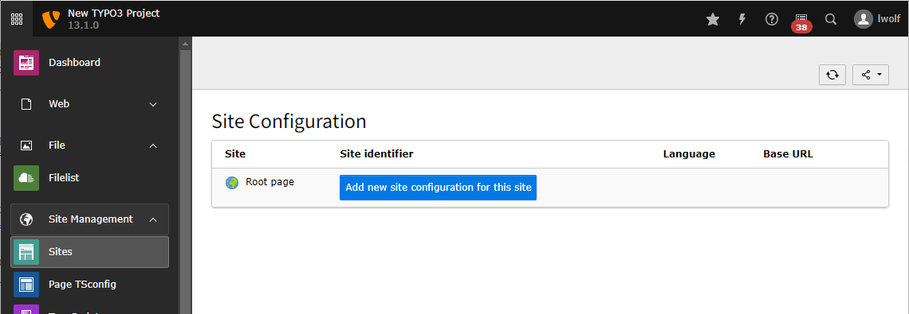
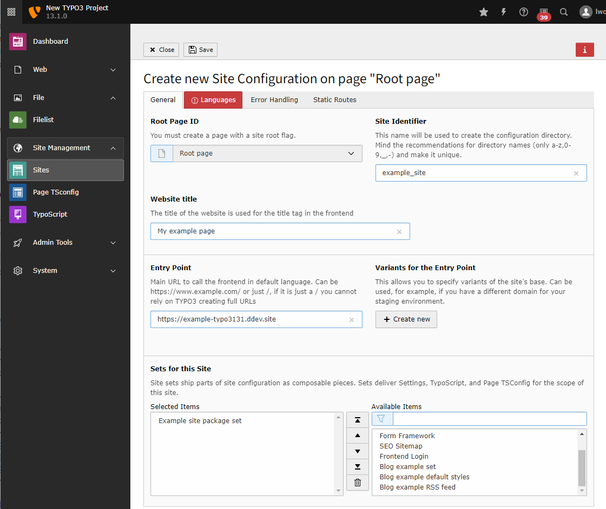
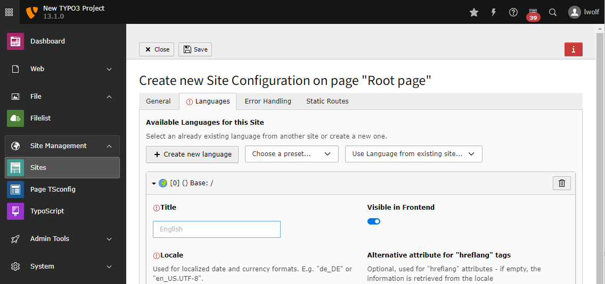

.. include:: /Includes.rst.txt

.. _typo3-backend-create-initial-pages:

====================
Create initial pages
====================

In the next step, we create some initial pages. You and your editors will be
able to create further pages, remove pages, enable and disable pages and
shuffle pages around in the future. The following page tree is just an example
as a starting point.

Go to module :guilabel:`Web > Page`. Assuming, we are using a
fresh installation of TYPO3 as
outlined in section :ref:`prerequisites`, an almost empty area is shown in the
page tree area. The only entry is the name of the website as defined during the
installation process (e.g. "New TYPO3 site") with a grey TYPO3 logo.

By clicking the page icon with the "plus" at the top, and then dragging the
"standard page" icon to its appropriate position in the page tree, you can
build the following page tree. Enter the page names as shown (a double-click on
the page name allows you to rename it).

.. include:: /Images/AutomaticScreenshots/CreateInitialPages.rst.txt

By default, all new pages are disabled (marked as a red icon at the bottom
right). Enable all pages by clicking the "Enable" link in the context menu.

.. include:: /Images/AutomaticScreenshots/EnablePagesInContextMenu.rst.txt

Once all pages have been created, you should end up with the following page
tree.

.. include:: /Images/AutomaticScreenshots/FinalPageTree.rst.txt

.. _typo3-backend-site:

Site configuration
==================

The site configuration is stored in a file called
:file:`config/sites/[site_identifier]/config.yaml`. For your convenience you
can create and edit this file with the backend module
:guilabel:`Site Management > Sites`.

The root page you just created should be listed in this module. Click on the
button :guilabel:`Add new site configuration` beside that page to create a
site configuration for it.

    Create a new site configuration

In the next step you can enter some basic information about the site.

The site identifier will can be arbitrary so we use "example_site" here.
The entry point should be an URL pointing to the web root. In our example this
is a URL generated by ddev.

From the list of available sets choose the set that we created in
:ref:`site_set`. We called in "Example site package set" in this example.

    Enter the basic data and choose the site set

As our set already depends on the set of fluid_styled_content it is not
necessary to chose that set here.

    Create a language for your site by choosing it from the list of presets

In the next two tabs you can define error handling like a custom 404 and static
routes, for example to a :file:`robots.txt`. We do not cover these topics here.

Here you can read about :ref:`Site handling <t3coreapi:sitehandling>` in general.

After saving a new file should have been created in your project:

..  literalinclude:: _config.yaml
    :language: yaml
    :caption: config/sites/example_site/config.yaml

Preview the page
================

At this point, it is a good time to preview what we have achieved so far. Go to
:guilabel:`Web > View` and try a few different screen widths. The two buttons at the
top left of the screen (marker 1) allow you to show/hide the page tree and to
minimize the function menu at the left.

.. include:: /Images/AutomaticScreenshots/ExtensionInstallationPreviewPage.rst.txt

The preview shows the frontend with a menu (*NavBar*) at the top. In a mobile
view (narrow screen width), a button provides access to a toggle menu. However,
only one link is shown in the menu: "Home". The other pages we have created in
the backend are still missing. Besides the menu, a large "Hello, world!" greets
the visitors of the website. This is the "Jumbotron"-partial. Below that, three
columns are shown, each of them with a "Heading". In a mobile view, these
columns stack on top of each other nicely.

Let's update the Fluid template files and implement a simple menu and enable
dynamic content that can be edited in the TYPO3 backend in the next steps.
