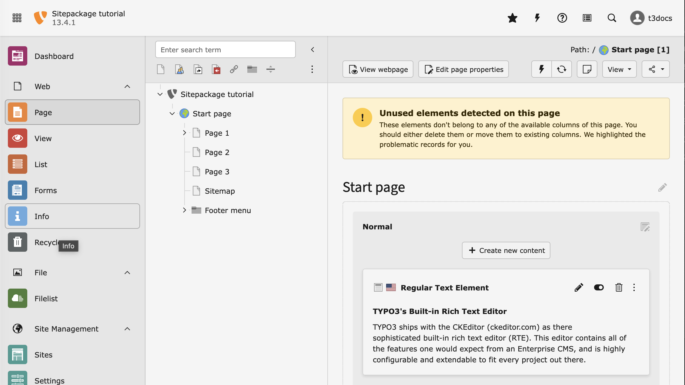
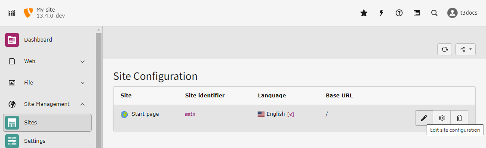

.. include:: /Includes.rst.txt

.. _typo3-backend-create-initial-pages:

====================
Create initial pages
====================

To follow this tutorial you need to have a few pages in your page tree and some
content elements on those pages. You also need a basic site configuration.

..  _load-example-data:

Load the example data automatically
===================================

We have a created a small extension that loads the example data into your
installation. We suggest you work with this data while you are following this
tutorial.

Install extension :composer:`t3docs/site-package-data` to load the example
data required in this tutorial. It works similarly to the Introduction package,
:composer:`typo3/cms-introduction`.

..  code-block:: bash

    ddev composer req t3docs/site-package-data
    ddev typo3 extension:setup

Loading the data might take a few seconds. If you do not see the new pages try
reloading the backend.

    The page tree in the module :guilabel:`Web > Page` now contains a few example pages.

.. _typo3-backend-site:

Site configuration
==================

If you followed :ref:`load-example-data` a basic configuration has
been created for you.

The site configuration is stored in a file called
:file:`config/sites/main/config.yaml`. You can edit this file in the
backend module :guilabel:`Site Management > Sites`.

    Edit the site configuration in  :guilabel:`Site Management > Sites`

If you want to create a site configuration manually see
:ref:`Create a new site configuration <t3start:site-configuration>` in the
"Getting Started Tutorial".
