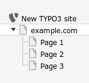
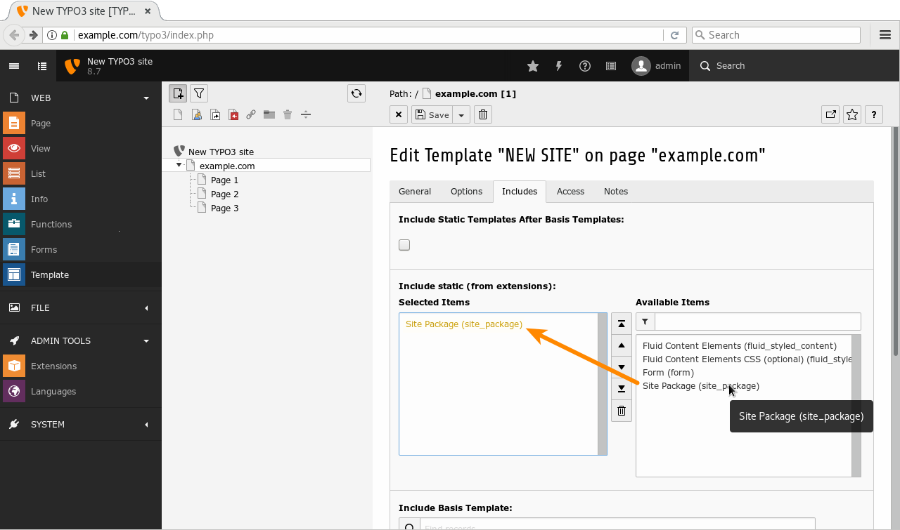

.. include:: ../Includes.txt

.. _extension-installation:

======================
Extension Installation
======================

This tutorial assumes that your TYPO3 instance is a brand new installation,
without any themes, templates, pages or content. See the :ref:`TYPO3
Installation Guide <t3install:start>` for a detailed explanation how to set up
a TYPO3 instance from scratch. For the sake of simplicity, it is also assumed
that TYPO3 has been installed the *traditional way*, by extracting the source
package into the web directory **without** using PHP *composer*.

By using this method, extensions (e.g. the site package extension) can be
installed using the Extension Manager, which is a so-called *module* of the
backend of TYPO3. Before we can install the site package extension, we have to
transfer the files from our local machine to the TYPO3 server (if all files and
directories have been created on the local machine though).

In case you have SSH/FTP access to the server, copy the directory
:file:`site_package` (including all files and sub-directories) to the
following directory in your TYPO3 instance: :file:`typo3conf/ext/`.

If you do not have SSH/FTP access, create a ZIP file of the **content** of your
:file:`site_package` folder. It is important that the ZIP archive does not
contain the directory :file:`site_package` and its files and directories inside
this folder. The files and folders must be directly located on the first level
of ZIP archive.

.. @TODO clarify, if the file name of the ZIP is relevant.

.. _typo3-backend-extension-manager:

Extension Manager
=================

First of all, login at the backend of TYPO3 as a user with administrator
privileges. At the left side you find a section **ADMIN TOOLS** with a module
named "Extensions" (marker 1). Open this module and make sure, the drop down
box on the right hand side shows "Installed Extensions" (marker 2). If you have already
uploaded the site package extension via SSH/FTP, search for "Site
Package". If you created a ZIP file, upload the ZIP'ed extension by clicking
the upload icon (marker 3).

.. figure:: ExtensionManager.png
   :alt: Extension Manager
   :class: with-shadow

   TYPO3 Extension Manager

Once the site package extension appears in the list, you can activate it by
clicking the "plus" icon (marker 4), if not already done.

.. _typo3-backend-create-initial-pages:

Create Initial Pages
====================

In the next step, we create some initial pages. You and your editors will be
able to create further pages, remove pages, enable and disable pages and
shuffle pages around in the future. The following page tree is just an example
as a starting point.

Go to **WEB → Page**. Assuming, we are using a fresh installation of TYPO3 as
outlined in section :ref:`prerequisites`, an almost empty area is shown in the
page tree area. The only entry is the name of the website as defined during the
installation process (e.g. "New TYPO3 site") with a grey TYPO3 logo.

By clicking the page icon with the "plus" at the top, and then dragging the
"standard page" icon to its appropriate position in the page tree, you can
build the following page tree. Enter the page names as shown (a double-click on
the page name allows you to rename it).

.. figure:: CreateInitialPages.png
   :alt: Create Initial Pages
   :class: with-shadow

   Create initial pages

By default, all new pages are disabled (marked as a red icon at the bottom
right). Enable all pages by clicking the "Enable" link in the context menu
(marker 1).

.. figure:: EnablePagesInContextMenu.png
   :alt: Enable Pages in Context Menu
   :class: with-shadow

   Enable Pages in Context Menu

Once all pages have been created, you should end up with the following page
tree.

.. .. code-block: : none
..
..   New TYPO3 site
..    │
..    └── example.com
..         │
..         ├── Page 1
..         │
..         ├── Page 2
..         │
..         └── Page 3

.. _typo3-backend-typoscript-template:

TypoScript Template
===================

Now we will add a TypoScript template to the site and include the TypoScript
configuration we have created during the development of our site package. Do
not be confused about the terminology "template". In this context, we are
referring to a so-called TypoScript template, not a HTML/CSS/JS template.

Go to **WEB → Template** and select the page named "example.com". Then, click
button "Create template for a new site" and change the dropdown box at the top
to "Info/Modify". Click button "Edit the whole template record", which opens an
editor for Constants and Setup. The latter contains a few example lines ("HELLO
WORLD!"). Remove these lines, so that the box is completely empty.

Change to tab "Includes" and look for the section "Include static (from
extensions)", which shows two boxes: "Selected Items" (left hand side) and
"Available Items" (right hand side). Under "Available Items", click "Site
Package (site_package)", which moves the entry to the left box.

Now save your changes by clicking the "save" icon at the top.

Preview Page
============

At this point, it is a good time to preview what we have achieved so far. Go to
**WEB → View** and try a few different screen widths. The two buttons at the
top left of the screen (marker 1) allow you to show/hide the page tree and to
minimize the function menu at the left.

.. figure:: PreviewPage.png
   :alt: Preview Page
   :class: with-shadow

The preview shows the frontend with a menu (*NavBar*) at the top. In a mobile
view (narrow screen width), a button provides access to a toggle menu. However,
only one link is shown in the menu: "Home". The other pages we have created in
the backend are still missing. Besides the menu, a large "Hello, world!" greets
the visitors of the website. This is the "Jumbotron"-partial. Below that, three
columns are shown, each of them with a "Heading". In a mobile view, these
columns stack on top of each other nicely.

Let's update the Fluid template files and implement a simple menu and enable
dynamic content that can be edited in the TYPO3 backend in the next steps.
