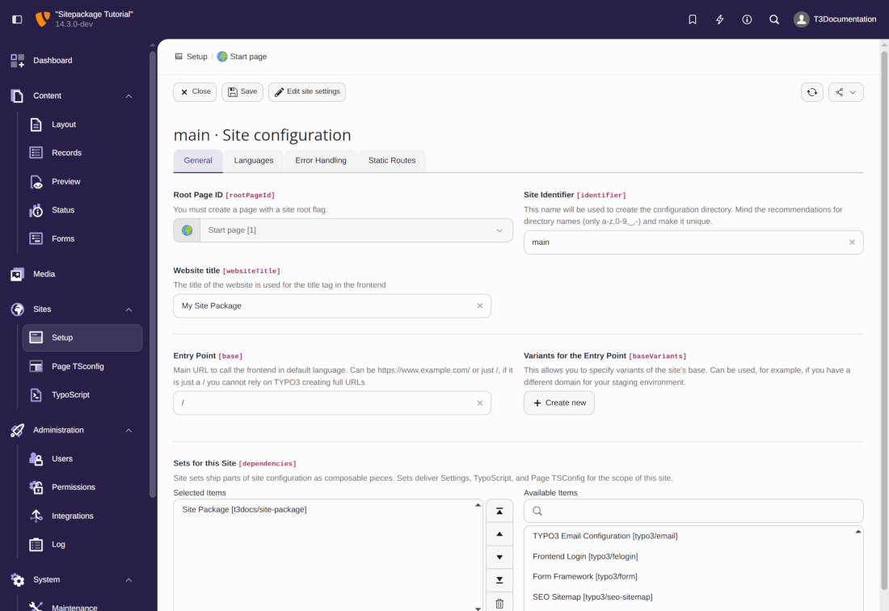

.. include:: /Includes.rst.txt
.. highlight:: typoscript

.. _minimal-design:

====================
Minimal site package
====================

A site package is a custom TYPO3 extension which contains configuration,
templates, assets, etc that are used for the site it belongs to.

So first we create a minimal extension.

..  contents::

.. _minimal-extension:

Create a minimal TYPO3 extension using b13/make
===============================================

:composer:`b13/make` is a convenient TYPO3 extension which you can use during
development to create a new TYPO3 extension quickly or add functionality to an
existing one.

Use Composer to install it for development only:

..  code-block:: bash

    ddev composer req b13/make --dev

Execute the command `ddev typo3 make:extension` and answer the prompt

..  code-block:: bash

    ddev typo3 make:extension

     Enter the composer package name (e.g. "vendor/awesome"):
     > myvendor/my-site-package

     Enter the extension key [my_site_package]:
     >

     Enter the PSR-4 namespace [Myvendor/MySitePackage]:
     >

     Choose supported TYPO3 versions (comma separate for multiple) [TYPO3 v12 LTS]:
      [10] TYPO3 v10 LTS
      [11] TYPO3 v11 LTS
      [12] TYPO3 v12 LTS
      [13] TYPO3 v13
     > 13

     Enter a description of the extension:
     > My site package

     Where should the extension be created? [src/extensions/]:
     > packages

     May we add a basic service configuration for you? (yes/no) [yes]:
     > no

     May we create a ext_emconf.php for you? (yes/no) [no]:
     >

     [OK] Successfully created the extension my_site_package (myvendor/my-site-package).

This script creates a new folder called `packages` with a subfolder,
`my-site-package`. It mainly contains only a file called `composer.json`.

You could of course also create this file manually. Step
:ref:`extension-configuration-composer` will explain the content of the :file:`composer.json`.
For the time being just remember the Composer name you have chosen
(`myvendor/my-site-package`) and the extension name (`site_package`).

In order to see a change in the TYPO3 backend or frontend your site package needs
to be :ref:`installed <extension-installation>`.

After you have created your site package extension you can uninstall :composer:`b13/make`:

..  code-block:: bash

    ddev composer remove b13/make --dev

Before your brand new site package extension takes effect in your TYPO3
installation, you have to install it. First you have to edit your composer.json in the root of your installation directory to add `packages` as a local repository.

.. include:: /Includes.rst.txt

.. _extension-installation:

Extension installation
======================

This tutorial assumes that your TYPO3 instance is a brand new installation,
without any themes, templates, pages or content.

We assume that you are working on your local machine using DDEV and that you
followed these steps:

:ref:`Installing TYPO3 with DDEV <t3start:installation-ddev-tutorial>`

..  contents::

.. _extension-installation_with_composer:

Install the site package you just created
-----------------------------------------

From all extensions, including our site package extension, must be installed
via Composer.

As a site package is created with site-specific files it is usually best to keep
the files together in a version control system such as Git.

Create a directory for local version-controlled extensions at the
root-level of your installation. The name is arbitrary, we use
:file:`packages/` here.

Then edit your :file:`composer.json` in the root of your installation directory
to add the path as a local repository.

Add the following lines:

.. code-block:: json
   :caption: page_root/composer.json

   {
      "name": "myvendor/mysite",
      "repositories": [
         {
            "type": "path",
            "url": "./packages/*"
         }
      ],
      "require": {
         "typo3/cms-core": "^13.4",
         "..." : "..."
      },
      "..." : "..."
   }

Move your extension folder :path:`my-site-package/` into the :path:`packages/`
folder. Then *require* the extension via Composer using the
package name defined in the site package extension's :file:`composer.json` now located
at :file:`packages/my-site-package/`

.. code-block:: json
   :caption: packages/my-site-package/composer.json

   {
      "name": "myvendor/my-site-package"
   }

require it by:

.. code-block:: bash
   :caption: Execute in directory page_root

    composer require myvendor/my-site-package:@dev

Project file structure
----------------------

Your project should now have the following structure:

..  directory-tree::
    :level: 1
    :show-file-icons: true

    *   .ddev

        *   :ref:`[Some configuration] <t3start:installation-ddev-tutorial>`

    *   config

        *   sites

            *   :ref:`[site identifier] <typo3-backend-site>`

                *   config.yaml

    *   packages

        *   site_package

            *   [All sitepackage files]

            *   composer.json

    *   public

        *   fileadmin

            *   [Images for content, PDFs, ...]

        *   [public files needed by TYPO3]

    *   var

        *   log
        *   [private files needed by TYPO3]

    *   vendor

        *   [All installed packages, including TYPO3 source]

    *   composer.json
    *   composer.lock

.. _minimal-extension-siteset:

Create a basic site set
=======================

..  versionadded:: 13.1
    :ref:`Site sets <t3coreapi:site-sets>` have been introduced.

Create a folder called :path:`Configuration/Sets/Minimal/` in the site package
and add a file called :file:`config.yaml` to it. This file contains the
**site set** of your site package:

..  literalinclude:: _config.yaml
    :caption: packages/my-site-package/Configuration/Sets/SitePackage/config.yaml

You will learn more about site sets in chapter
:ref:`site_set`.

You can find the complete reference in TYPO3 explained:
:ref:`Site sets <t3coreapi:site-sets>`.

Edit the site configuration that was created in step :ref:`typo3-backend-site`
and add the site set to it. You can do this by using the backend module:

    Use module :guilabel:`Site Management > Sites` to add the "Minimal example site package"

On saving, the site package is added to your site configuration file, which changes to this:

..  literalinclude:: _config.yaml.diff

.. _minimal-extension-typoscript:
.. _make-typoscript-available:

The TypoScript-only version
===========================

..  versionadded:: 13.1
    A site set can be used as :ref:`TypoScript provider <t3coreapi:site-sets-typoscript>`.

Create a file called :file:`setup.typoscript` containing basic TypoScript configuration
in the folder of the site set you created in step :ref:`minimal-extension-siteset`:

..  literalinclude:: _minimal.typoscript
    :caption: packages/my-site-package/Configuration/Sets/SitePackage/setup.typoscript

Clear all caches and preview the web page.

You can learn more about the TypoScript syntax used here in chapter
:ref:`A minimal page created by pure TypoScript <t3start:typoscript>`
of the "Getting Started Tutorial".

.. _minimal-extension-fluid:

The TYPO3 Fluid version
=======================

Replace file :file:`setup.typoscript` of example
:file:`minimal-extension-typoscript` with the following lines:

..  literalinclude:: _pageview.typoscript
    :caption: packages/my-site-package/Configuration/Sets/SitePackage/setup.typoscript
    :linenos:

If you preview your page now you would get an error output like:

..  code-block:: html

    Oops, an error occurred! Request: bddd8a816bda3

.. todo: Add information about dealing with errors such as these and link from here.

This is because the template has not been found.

By searching for the hash `bddd8a816bda3` in the log file you will find such an entry:

..  code-block:: plaintext
    :caption: var/log/typo3_ece44d5005.log
    :emphasize-lines: 7

    Mon, 07 Oct 2024 04:09:44 +0000 [ALERT] request="bddd8a816bda3"
    component="TYPO3.CMS.Frontend.ContentObject.Exception.ProductionExceptionHandler":
    Oops, an error occurred! Request: bddd8a816bda3- InvalidTemplateResourceException:
    Tried resolving a template file for controller action "Default->Pages/Default"
    in format ".html", but none of the paths contained the expected template file
    (Default/Pages/Default.html).
    The following paths were checked: /var/www/html/vendor/myvendor/my-site-package/Resources/Private/Templates/

This error message also tells you the path where TYPO3 expects to find the file. If no path
is listed here, the path defined in line 6 of the TypoScript above is incorrect,
for example if you mistyped the extension name or part of the path.

Create a file named :file:`Default.html` in folder
:path:`packages/my-site-package/Resources/Private/Templates/Pages`.

.. code-block:: html
   :caption: packages/my-site-package/Resources/Private/Templates/Pages/Default.html

   Hello Fluid World!

Clear all caches and preview the web page.

Learn more about using Fluid Templates in chapter :ref:`fluid-templates`.

..  _cm-preview-page:

Preview page
============

Whenever we have made changes to the Fluid templates or TypoScript files, it is
necessary to :guilabel:`Flush frontend caches` in the menu in the
top bar before you can preview the page properly:

..  include:: /Images/AutomaticScreenshots/FlushFrontendCaches.rst.txt

You can then preview your page by clicking on the button :guilabel:`View webpage`
in the page module.

.. _extension-configuration-composer:

Composer configuration :file:`composer.json`
============================================

In step :ref:`Create a minimal TYPO3 extension <t3sitepackage:minimal-extension>`
a file called :file:`composer.json` was created for you:

.. include:: /CodeSnippets/ExtensionConfiguration/ComposerJson.rst.txt

At the top of the :file:`composer.json` file we see the Composer package name
`myvendor/my-site-package` (with a dash) and at the bottom we see the TYPO3
extension key in the extra section - :file:`site_package` (with an underscore).
The Composer "name" consists of a vendor name followed by a forward slash and the
lowercase extension name with dashes.

When you reference files in your extension, the extension key is used, for
example when setting your favicon in TypoScript:

..  code-block:: typoscript
    :caption: package/my-site-package/Configuration/Sets/SitePackage/setup.typoscript

    page {
        shortcutIcon = EXT:site_package/Ressources/Public/Icons/favicon.ico
    }
