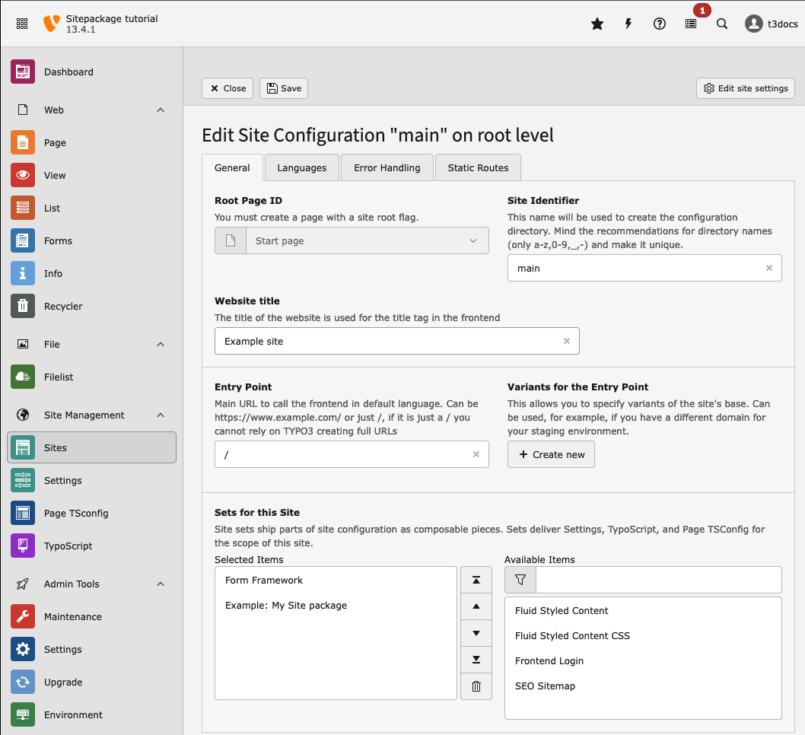

..  include:: /Includes.rst.txt
..  highlight:: typoscript

..  _minimal-design:
..  _site-package-builder:

=======================
Generate a site package
=======================

A site package is a custom TYPO3 extension which contains configuration,
templates, assets, etc that are used for the site it belongs to.

So first we generate a minimal extension.

..  contents::

.. _minimal-extension:
.. _minimal-site-package-builder:

Generate and download a site package
====================================

You can download a site package by using the official Site Package Builder at
https://get.typo3.org/sitepackage or by using curl.

You have the choice of three site packages types:

*   Bootstrap Package: This site package comes with a ready to use theme
*   Fluid Styled Content: A minimal site package where you can build your own
    custom theme.
*   Site Package Tutorial: Contains all files that are used as examples in
    this tutorial.

To follow this tutorial, chose "Site Package Tutorial" as type of the site package.

Download and unzip the zip file, place the result in folder
`packages/my_site_package`, and :ref:`install it <extension-installation>`.

.. _extension-installation:

Extension installation
======================

This tutorial assumes that your TYPO3 instance is a brand new installation,
without any themes, templates, pages or content.

We assume that you are working on your local machine using DDEV and that you
followed these steps:

:ref:`Installing TYPO3 with DDEV <t3start:installation-ddev-tutorial>`

.. _extension-installation-site-package:

Install the site package you just created
-----------------------------------------

If you used the Site Package Builder, file :file:`packages/my_site_package/README.md`
contains instructions on how to install your site package.

Move / unzip your extension folder :path:`my_site_package/` into the :path:`packages/`
folder. Then *require* the extension via Composer using the
package name defined in the site package extension's :file:`composer.json` now located
at :file:`packages/my_site_package/`

.. code-block:: json
   :caption: packages/my-site-package/composer.json

   {
      "name": "my-vendor/my-site-package"
   }

require it by:

..  code-block:: bash
   :caption: Execute in directory page_root

    ddev composer require my-vendor/my-site-package:@dev

..  _extension-installation-project-structure:

Project file structure
----------------------

Your project should now have the following structure:

..  directory-tree::
    :level: 1
    :show-file-icons: true

    *   .ddev

        *   :ref:`[Some configuration] <t3start:installation-ddev-tutorial>`

    *   config

        *   sites

            *   main

                *   config.yaml

    *   packages

        *   my_site_package

            *   [All sitepackage files]

            *   composer.json

    *   public

        *   fileadmin

            *   [Images for content, PDFs, ...]

        *   [public files needed by TYPO3]

    *   var

        *   log
        *   [private files needed by TYPO3]

    *   vendor

        *   [All installed packages, including TYPO3 source]

    *   composer.json
    *   composer.lock

.. _minimal-extension-siteset:

Look at the a basic site set
============================

..  versionadded:: 13.1
    :ref:`Site sets <t3coreapi:site-sets>` have been introduced.

The site package build by Site Package Builder comes with a ready to use
site set in folder :path:`packages/my_site_package/Configuration/Sets/SitePackage/`.

The set itself is defined within this folder in the file :file:`config.yaml`:

..  literalinclude:: /CodeSnippets/my_site_package/Configuration/Sets/SitePackage/config.yaml
    :caption: packages/my-site-package/Configuration/Sets/SitePackage/config.yaml
    :emphasize-lines: 1-2

You will learn more about site sets in chapter
:ref:`site_set`.

You can find the complete reference in TYPO3 explained:
:ref:`Site sets <t3coreapi:site-sets>`.

During installation of your site package a page tree with example content was
created, and should already have a site configuration in folder
:path:`config/sites/main`.

When you look at the site configuration in module :guilabel:`Site Management > Sites`
it should already contain the set "My Site package". Other sets, for example
if you want to use :composer:`typo3/cms-form` can be added here.

    Use module :guilabel:`Site Management > Sites` to add the "Example: My Site package"

If you made no changes, the site configuration should look like this:

..  literalinclude:: /CodeSnippets/my_site_package/Initialisation/Site/main/config.yaml
    :caption: config/sites/main/config.yaml

.. _minimal-extension-typoscript:
.. _make-typoscript-available:

The site set as TypoScript Provider
===================================

..  versionadded:: 13.1
    A site set can be used as :ref:`TypoScript provider <t3coreapi:site-sets-typoscript>`.

TYPO3 uses TypoScript as configuration language. The TypoScript is used to
configure the templates, which are created with the templating language Fluid.

A file called :path:`packages/my_site_package/Configuration/Sets/SitePackage/setup.typoscript`
provides the TypoScript to your site. This file contains imports of files from
folder :path:`packages/my_site_package/Configuration/Sets/SitePackage/TypoScript`
which contain the actual configuration.

You can learn more about the TypoScript syntax used here in chapter
:ref:`A minimal page created by pure TypoScript <t3start:typoscript>`
of the "Getting Started Tutorial".

.. _minimal-extension-fluid:

The TYPO3 Fluid version
=======================

File :path:`packages/my_site_package/Configuration/Sets/SitePackage/TypoScript/page.typoscript`
Defines how the output of all pages of the site is rendered with Fluid templates:

..  literalinclude:: /CodeSnippets/my_site_package/Configuration/Sets/SitePackage/TypoScript/page.typoscript
    :caption: packages/my_site_package/Configuration/Sets/SitePackage/TypoScript/page.typoscript
    :emphasize-lines: 6
    :linenos:

Line 6 defines from what directory the Fluid Templates are loaded. Line 7 allows
to override this part via settings.

Learn more about using Fluid Templates in chapter :ref:`fluid-templates`.

..  _cm-preview-page:

Preview page
============

Whenever we have made changes to the Fluid templates or TypoScript files, it is
necessary to :guilabel:`Flush frontend caches` in the menu in the
top bar before you can preview the page properly:

..  figure:: /Images/AutomaticScreenshots/FlushFrontendCaches.png
    :class: with-shadow

    Flush the frontend cache after changing template files

You can then preview your page by clicking on the button :guilabel:`View webpage`
in the page module.

.. _extension-configuration-composer:

Composer configuration :file:`composer.json`
============================================

In step :ref:`Create a minimal TYPO3 extension <t3sitepackage:minimal-extension>`
a file called :file:`composer.json` was created for you:

..  literalinclude:: /CodeSnippets/my_site_package/composer.json
    :caption: packages/my_site_package/composer.json
    :linenos:

At the top of the :file:`composer.json` file we see the Composer package name
`my-vendor/my-site-package` (with a dash) and at the bottom we see the TYPO3
extension key in the extra section - :file:`my_site_package` (with an underscore).
The Composer "name" consists of a vendor name followed by a forward slash and the
lowercase extension name with dashes.

When you reference files in your extension, the extension key is used, for
example when setting your favicon in TypoScript:

..  code-block:: typoscript
    :caption: package/my-site-package/Configuration/Sets/SitePackage/setup.typoscript

    page {
        shortcutIcon = EXT:my_site_package/Resources/Public/Icons/favicon.ico
    }
