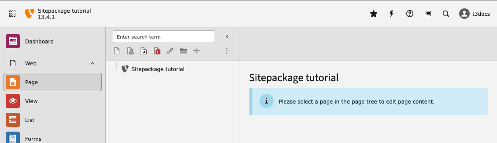

.. include:: /Includes.rst.txt

.. _prerequisites:

=============
Prerequisites
=============

Before you start working on this tutorial you should have a working TYPO3
installation in versions 13.3 or above.

We assume you use Composer and work locally with DDEV.

Your TYPO3 installation should be empty and have no pages, designs or third
party extensions installed.

You can follow this tutorial to install TYPO3 with DDEV and Composer:

*   :ref:`Installing TYPO3 with DDEV <t3start:installation-ddev-tutorial>`.

..  note:: Answer "no" when asked if you want to create a basic site.

You should be able to log in into the TYPO3 backend and see the following:

    A fresh, empty TYPO3 installation (light mode)

This TYPO3 tutorial assumes that the reader has some basic knowledge in the
following areas:

*   HTML, CSS and JavaScript
*   DDEV
*   Composer

It is also helpful if you know the following concepts:

*   Backend
*   Frontend
*   Page tree
*   How to create a page
*   How to create page content
*   The page module
*   The list module
*   The TypoScript module
