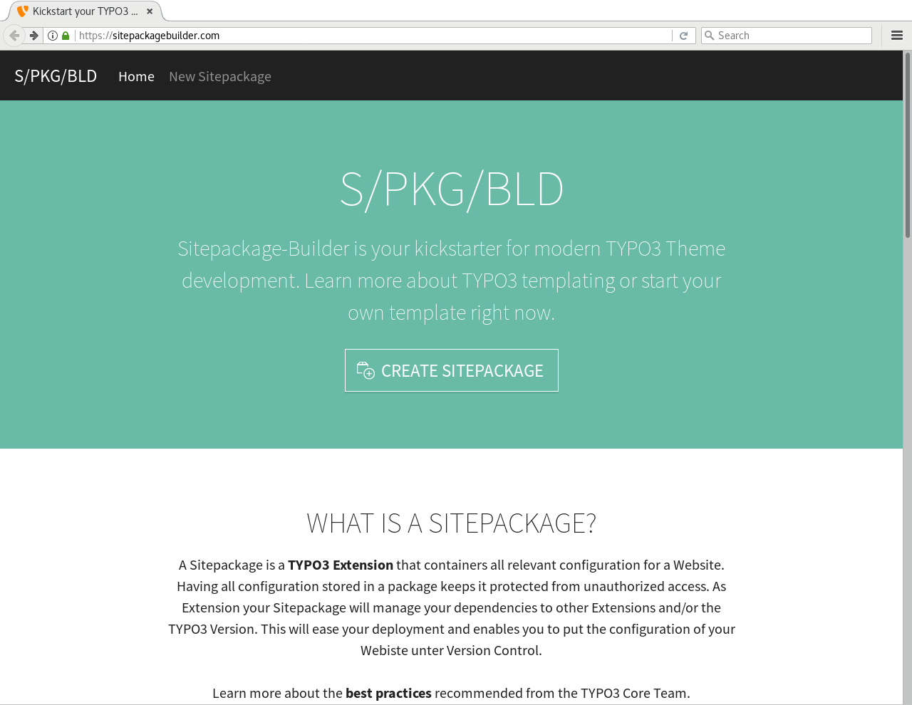

.. include:: ../Includes.txt

.. summary:

Summary
-------

First and foremost: **congratulations!** You reached a point where you have successfully implemented a custom Site Package for TYPO3. In fact, you have not only developed a "theme" for your website, you also built a fully working extension for TYPO3, which can be installed, uninstalled, copied to another TYPO3 instance and put under version control. You could also share your Site Package with others by uploading your extension to the `TYPO3 Extension Repository <https://extensions.typo3.org>`_.

The list below shows a quick summary what you have achieved by working through this tutorial.

- Split a "static" HTML/CSS/JavaScript template into Fluid templates (Layout, Templates and Partial).
- Applied "Fluid Styled Content" TypoScript (files ``constants.typoscript`` and ``setup.typoscript``).
- Included the `Bootstrap framework <https://getbootstrap.com>`_ and `jQuery <https://jquery.com>`_ library as external resources.
- Built a fully functional TYPO3 extension and installed this extension via the Extension Manager.
- Created some initial Pages, the TypoScript templates and learned how to preview a page in the backend.
- Developed a navigation menu using TypoScript and Fluid.
- Applied TypoScript to render the content (file ``DynamicContent.typoscript``).

This all sounds very sophisticated and complicated, but keep in mind, the extension (as it stands at this point in time) contains xxx files only, plus the HTML/CSS files. Except xxx files in the root level of the extension directory, non of these files are PHP files.

.. @TODO add number of files

.. next-steps:

Next Steps
^^^^^^^^^^

The Site Package extension, as it stands now, still has some shortfalls. Let's have a closer look what you could or should do as the next steps to address these.

.. one page layout only
.. navigation menu just one level
.. backend columns

*TODO: list known issues such as one page layout, just one menu level, BE columns, etc.*

It should be understood, that describing these actions is beyond the scope of this tutorial.

The nature of a tutorial, such as this document, is to provide detailed instructions to walk a beginner through a particular task. By building your own Site Package extension from scratch, you have learned each step that is required to turn a basic web design template into a fully working website in TYPO3.

When you create Site Packages in the future, you probably do not want to create every file over and over again, but use a pre-built version of the Site Package extension. Therefore, it make sense to store and maintain the current state in a central place, such as a Git repository. Despite the fact that for a learning experience it is always beneficial to develop the extension yourself, you find the extension built in this tutorial at `GitHub <https://github.com>`_.

.. site-package-free-to-download:

Site Package Free to Download
#############################

`GitHub <https://github.com>`_

*TODO: update link, once extension has been committed to GitHub.*

.. site-package-builder:

Site Package Builder
####################

Another option to create a Site Package extension quickly is an online tool developed by Benjamin Kott: the `Site Package Builder <http://sitepackagebuilder.com/>`_.

